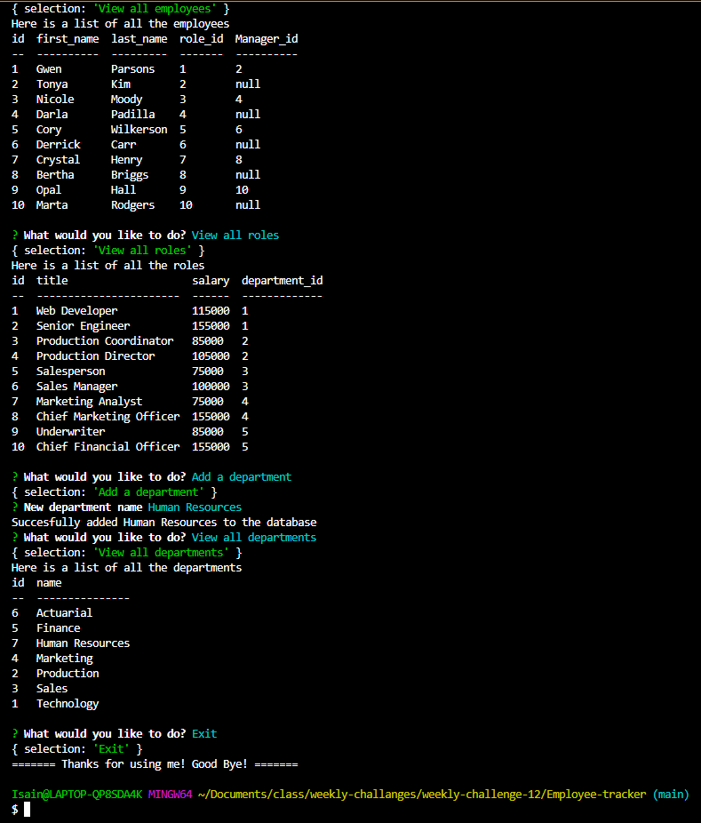

# Employee-tracker

## Description

This MySQL Employee Tracker application is an inquirer powered command line application that is backed by a MySQL database. When launched the user is given a few options to view all employees, departments, or roles, and given the option to add a new department, role, or employee. Once the user selects their option and completes their action the same startup menu is rendered again giving the user the ability to add or view as many departments, roles, or employees.

## Screenshot of application

## Link to walkthrough video

https://drive.google.com/file/d/1YYY1C5Zq6Kzfs7wa1pSrCHbhxuo0jZQO/view

